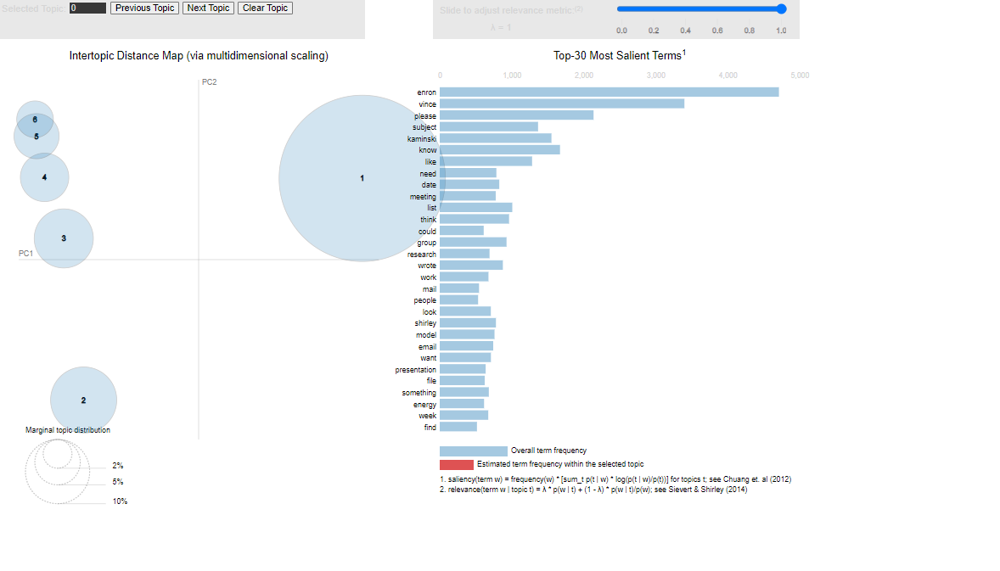
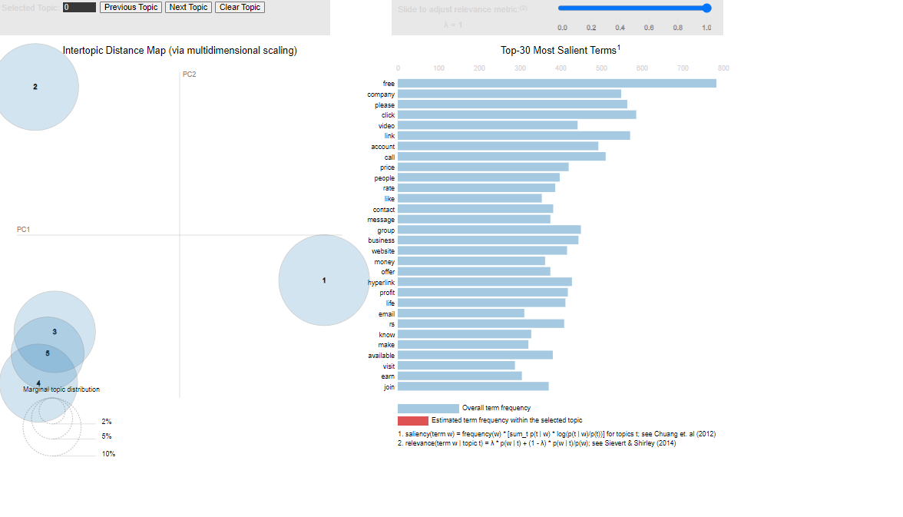

# VK_ML

1. Провести базовую аналитику по имеющимся данным
2. Обучить модель по тексту сообщения определять, является ли ее содержимое спамом
3. Целевой метриков при оценке работы модели будет ROC-AUC
4. Провести скоринг лучшей моделью тестовых данных, результат записать в csv-файл с колонками score и text

_________

### [Сам код тут](Vk_ML.ipynb)
### Дополнительно
1. Тематическое моделирование для сообщений без содержания спама

2. Тематическое моделирование для сообщений без содержания спама

